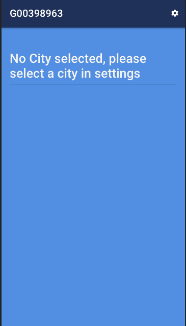
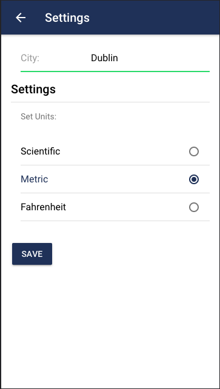
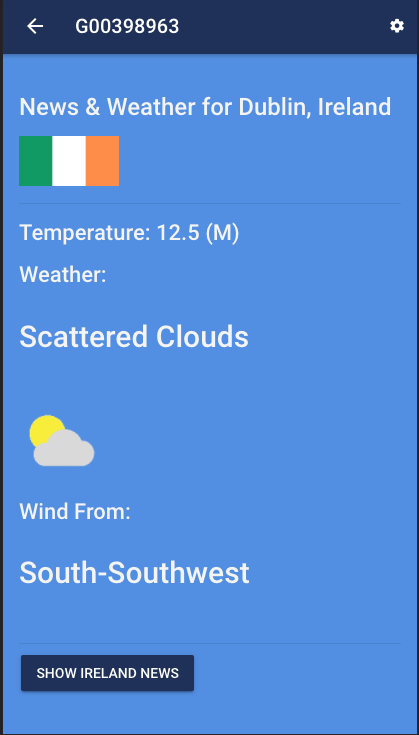
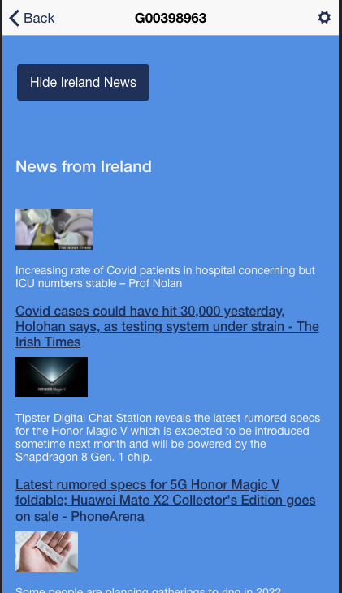
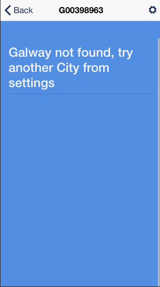

# Weather News App

StudentId : G00398963

This is the final project for the Module "Mobile Application Development" of the H.Dip in Software Development- GMIT

## Technologies Used

Ionic Framework V3
Typescript
HTML
CSS
Visual Studio Code 

### Features

No weather will be displayed when no city selected 

Go to settings, select city and units and save

See the weather for the selected city 

Click the button to show the news

If the selected city is not found then the following error will display

### Disclaimer
The content of this app is for eductaional purpose only

